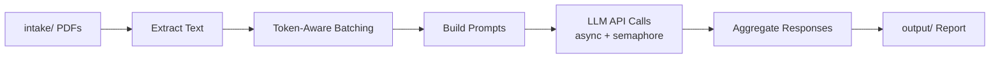

# literature_lens

Automated literature screening and prioritization pipeline powered by LLMs.

---

## What It Does

`literature_lens` helps researchers cut through high volumes of academic papers by screening and prioritizing them against a specific research angle. When facing 30+ new papers weekly, this tool identifies what deserves your close attention first.

- **Screens and prioritizes** papers against your defined research context
- **Surfaces the most relevant papers** and pinpoints key sections worth reading
- **Generates a structured report** with a summary table, relevance ratings, and per-paper evaluations
- **Designed for high-volume discovery** — drop papers in, run, get a report, repeat

> ⚠️ This tool assists with initial screening and prioritization. It does not replace critical reading or scholarly judgment.

---

## How It Works

```
intake/ (PDFs)
    │
    ▼
[pdf_reader.py]  — Extract text, page by page
    │
    ▼
[batcher.py]     — Group papers into token-aware batches
    │
    ▼
[prompt_builder.py] — Assemble system + user prompts per batch
    │
    ▼
[llm_client.py]  — Async concurrent API calls (with retry)
    │
    ▼
[report_writer.py] — Aggregate responses → Markdown report
    │
    ▼
output/report_YYYYMMDD_HHMMSS.md
```

Or as a Mermaid diagram:



---

## Setup

**1. Clone the repo**
```bash
git clone https://github.com/your-username/literature_lens.git
cd literature_lens
```

**2. Create a virtual environment and install dependencies**
```bash
python -m venv .venv
source .venv/bin/activate      # Windows: .venv\Scripts\activate
pip install -r requirements.txt
```

**3. Configure your API key and endpoint**
```bash
cp .env.example .env
```
Open `.env` and fill in all three values:
```
OPENAI_BASE_URL=https://your-openai-compatible-endpoint/v1
DASHSCOPE_API_KEY=your_actual_key_here
LLM_MODEL=qwen3.6-plus
```
`OPENAI_BASE_URL` accepts any OpenAI-compatible endpoint (OpenAI, Azure OpenAI, DashScope, Ollama, etc.).
`LLM_MODEL` accepts any model name supported by your endpoint.

**4. Edit your research angle**

Open `prompts/research.md` and fill in:
- Your research focus and questions
- Your dataset or methodology
- What kinds of findings or methods you're looking for

> 💡 See `prompts/research.example.md` for a filled-in template you can use as a reference.

**5. Drop PDFs into `intake/`**
```bash
cp ~/Downloads/*.pdf intake/
```

**6. Run the pipeline**
```bash
python main.py
```

**7. Find your report in `output/`**
```
output/report_20260412_143022.md
```

---

## Configuration

All tunables live in `config.yaml`:

| Field | Description |
|-------|-------------|
| `api.base_url_env` | Name of the env var holding your API base URL |
| `api.model_env` | Name of the env var holding your LLM model name |
| `api.api_key_env` | Name of the env var holding your API key |
| `api.max_tokens` | Max tokens for each LLM response |
| `api.temperature` | Sampling temperature (lower = more deterministic) |
| `api.max_concurrent_requests` | How many API calls run in parallel |
| `batch.max_papers_per_batch` | Max papers sent in a single API call |
| `batch.max_tokens_per_batch` | Token budget per batch (stay under model context limit) |
| `paths.intake_dir` | Where to look for PDFs |
| `paths.prompt_file` | Path to your research angle file |
| `paths.output_dir` | Where reports are written |

---

## Output Format

Reports are saved as `output/report_YYYYMMDD_HHMMSS.md` and look like this:

```markdown
# Literature Lens Report
**Generated**: 2026-04-12 14:30:22
**Papers Screened**: 8

## Research Angle
> # Research Angle
> ## My Research Focus
> Investigating the effect of retrieval-augmented generation on ...

## Summary Table
| # | Paper | Relevance | Key Pages |
|---|-------|-----------|-----------|
| 1 | smith_2024_rag_survey.pdf | High | 3, 7–9, 14 |
| 2 | jones_2023_attention.pdf | Medium | 5, 11 |
| 3 | brown_2022_scaling.pdf | Low | - |

## Detailed Evaluations

### smith_2024_rag_survey.pdf
**Relevance**: High
**Why it's useful**: Directly surveys RAG architectures with a focus on ...
**Key pages**: 3, 7–9, 14
**Key findings**:
- Retrieval step accounts for 40% of end-to-end latency in production pipelines
- Hybrid dense-sparse retrieval outperforms either approach alone on BEIR
- Re-ranking with a cross-encoder closes most of the remaining quality gap
**Methodology & data**: Benchmarks seven open-source RAG systems on the BEIR
dataset (18 retrieval tasks). Uses a standardised evaluation harness with NDCG@10
as the primary metric. All experiments run on a single A100 node.

---

### jones_2023_attention.pdf
**Relevance**: Medium
**Why it's useful**: ...
**Key pages**: 5, 11
**Key findings**:
- ...

---

### brown_2022_scaling.pdf
**Relevance**: Low
**Key findings**:
- ...
```

**Evaluation fields by relevance level:**

| Field | High | Medium | Low |
|-------|------|--------|-----|
| Relevance rating | yes | yes | yes |
| Why it's useful | yes | yes | |
| Key pages to read | yes | yes | |
| Key findings (3) | yes | yes | yes |
| Methodology & data | yes | yes | |

---

## License

MIT — see [LICENSE](LICENSE).
